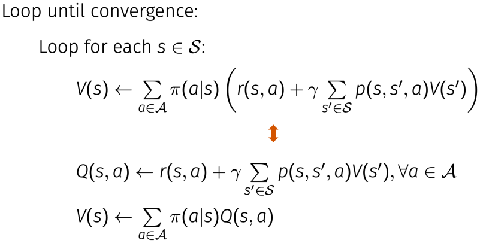
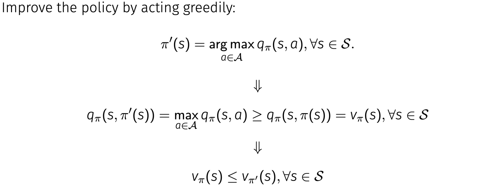
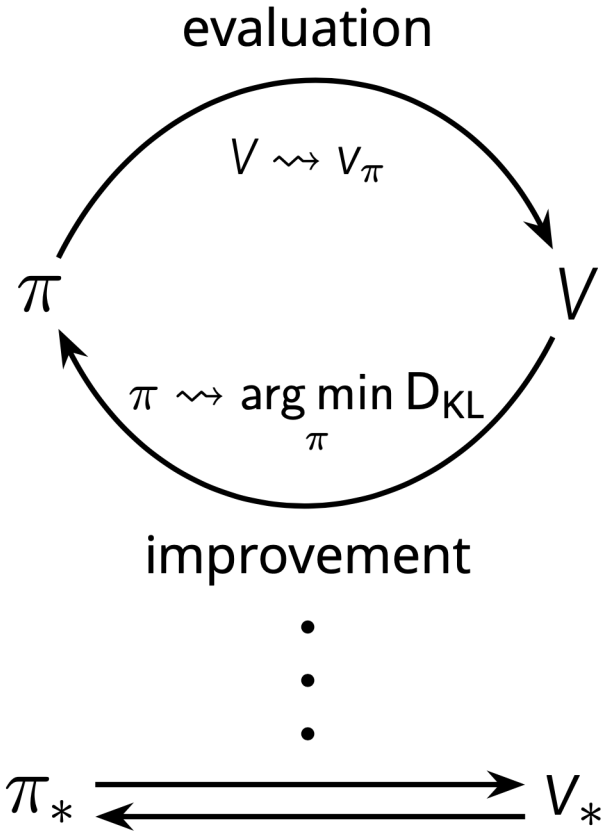
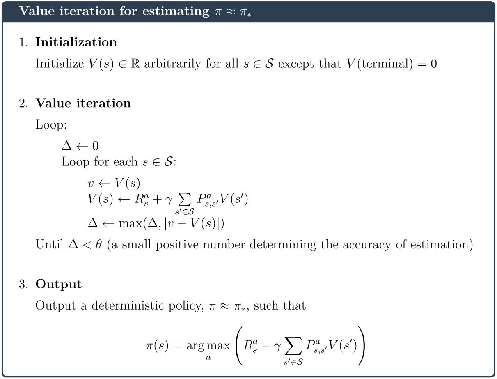
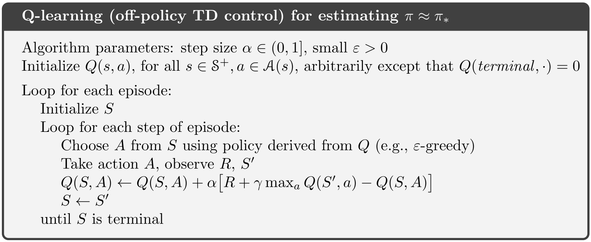

# Atari RL

**Requirements**

**Bias-Variance for Deep Reinforcement Learning: How To Build a Bot for Atari with OpenAI Gym**

References:

- [https://github.com/alvinwan/bots-for-atari-games](https://github.com/alvinwan/bots-for-atari-games)

## 1. Setup the Environment

**Install Miniconda**

For Windows (x86_64), download the [installer](https://repo.anaconda.com/miniconda/Miniconda3-latest-Windows-x86_64.exe) to install and you can skip the rest of this section.

For macOS and Linux, execute the following shell commands to install Miniconda:

```shell
$ curl -OJ https://mirrors.tuna.tsinghua.edu.cn/anaconda/miniconda/Miniconda3-latest-Linux-x86_64.sh
$ bash ./Miniconda3-latest-Linux-x86_64.sh
```

> - References: https://docs.conda.io/en/latest/index.html
> - As the official link is unreachable or too slow, here I replace the original link with the Tsinghua mirror.

**Setup a new conda environment**

```shell
$ conda create --name atari_env python=3.8
$ conda activate atari_env
$ conda install -c conda-forge opencv=4.2.0
$ conda install pip
$ pip install gym
$ pip install "gym[atari]"
$ pip install tensorflow
$ pip install numpy
```

## 2. Baseline Random Agent

See `bot_random.py`

## 3. Reinforcement Learning Basics

### 3.1 Dynamic Programming

**Policy evaluation**



**Policy improvement**



**Policy iteration**



**Value iteration**



## 4. Q-Learning Agent for FrozenLake

**Q-learning**



See `bot_q_learning.py`

## 5. Deep Q-Learning Agent for FrozenLake

## 6. Bias-Variance Tradeoffs

## 7. Least Squares Agent for FrozenLake

## 8. Deep Q-Learning Agent for Space Invaders
