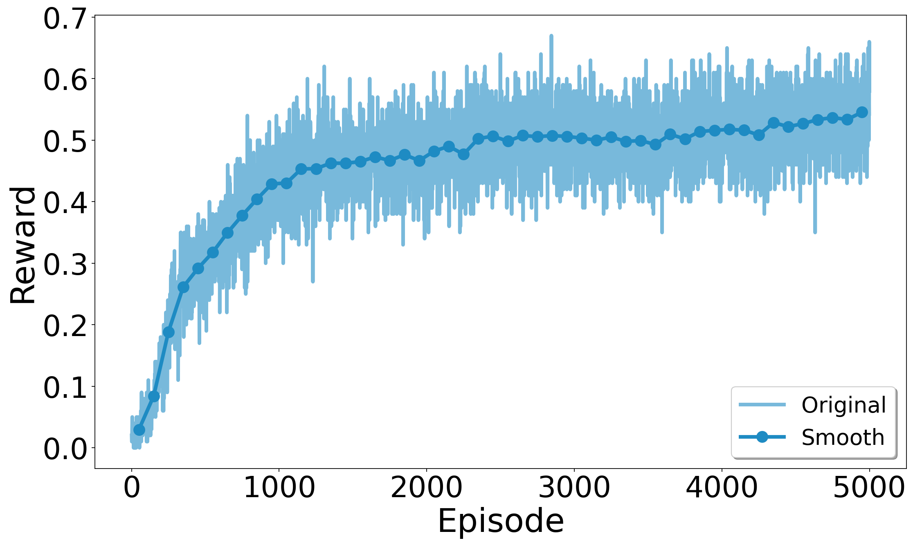

# Atari RL

To-Do List:
- [ ] Migrate TensorFlow 1 to Tensorflow 2.
- [ ] Typeset a LaTeX documentation.

**Requirements**

**Bias-Variance for Deep Reinforcement Learning: How To Build a Bot for Atari with OpenAI Gym**

References:

- [https://github.com/alvinwan/bots-for-atari-games](https://github.com/alvinwan/bots-for-atari-games)

## 1. Setup the Environment

[setup.md](setup.md)

## 2. Baseline Random Agent

`python random_agent.py`

## 3. Reinforcement Learning Basics

### 3.1 Dynamic Programming

**Policy evaluation**


**Policy improvement**


**Policy iteration**


**Value iteration**


## 4. Q-Learning Agent for FrozenLake

**Q-learning**


### 4.1 运行单次

```shell
$ python q_learning_agent.py
```

### 4.2 运行多次取平均并画图

```shell
$ python run_q_learning.py
$ python plot.py q_learning
```

Episode reward of Q-learning on FrozenLake-v0 (averaged over 100 repetitions)



## 5. Deep Q-Learning Agent for FrozenLake

`python q_network_agent.py`

## 6. Bias-Variance Tradeoffs

## 7. Least Squares Agent for FrozenLake

`python least_squares_agent.py`

## 8. Deep Q-Learning Agent for Space Invaders

- Without GUI: `python dqn_agent.py`
- With GUI: `python dqn_agent.py --visual`
